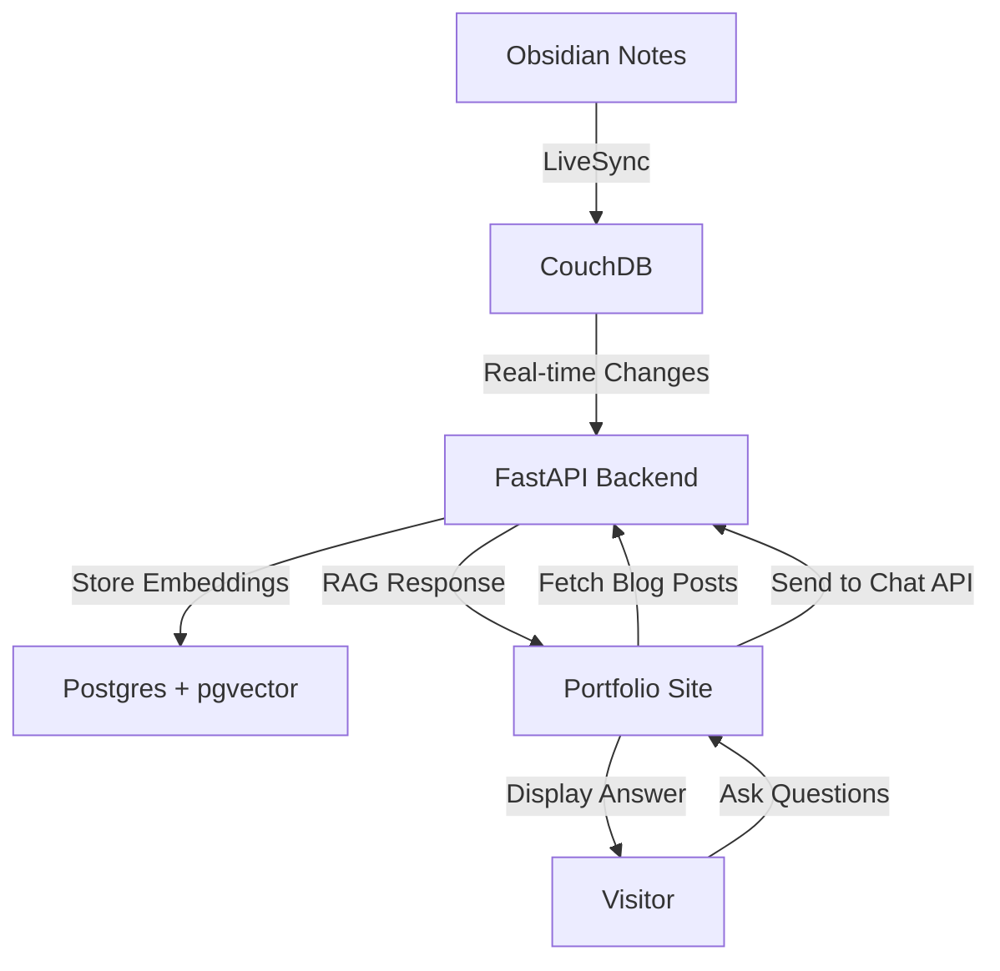

# TACOS: Ted's AI Chatbot & Obsidian Sync

A self-hosted backend that powers [tedawf.com](https://github.com/tedawf/tedawf.com) with real-time content sync from Obsidian and a RAG-powered AI chatbot.

## 🚀 Features

- **Auto-sync from Obsidian**: Blog posts and personal notes update instantly via [Obsidian LiveSync](https://github.com/vrtmrz/obsidian-livesync)
- **AI Chatbot**: Answers questions about my portfolio content using RAG
- **Content API**: Serves blog posts and images directly from CouchDB
- **Vector Search**: Semantic search with Postgres + pgvector
- **Self-hosted**: Runs on my proxmox homelab

## 🏗️ How It Works



### In Other Words

1. **Write in Obsidian** - I create blog posts and notes in my Obsidian vault
2. **Auto-sync to CouchDB** - LiveSync plugin pushes changes instantly
3. **FastAPI processes changes** - Listens for `_changes` and ingests new content
4. **Embeddings generated** - OpenAI text embeddings for semantic search
5. **Store in Postgres** - Free vector database with pgvector extension
6. **Chatbot queries** - When you ask a question, it finds similar content and ranks them
7. **Chatbot responds** - Uses retrieved context to answer specifically about my work

### Data Sources
- **Blog Posts** (`blog/` in Obsidian)
- **Personal KB** (`kb/` in Obsidian)
- **Portfolio Content** (via `/update` API)

## 🛠️ Quick Setup

### Prerequisites
- Python 3.11+
- CouchDB 3.x
- Postgres 13+ with pgvector
- Obsidian + LiveSync plugin

### 1. Environment
Copy `.env.example` to `.env` key vars are:
```env
COUCHDB_HOST=localhost
COUCHDB_DATABASE=obsidian_db
POSTGRES_HOST=localhost
POSTGRES_DATABASE=tacos_db
TACOS_API_KEY=your_custom_key
OPENAI_API_KEY=your_openai_key
```

### 2. Databases

#### CouchDB installation
https://docs.couchdb.org/en/stable/install/unix.html

#### Postgres + pgvector
```bash
CREATE EXTENSION IF NOT EXISTS vector;
alembic upgrade head
```

### 3. Obsidian Sync
1. Install LiveSync plugin from the Obsidian community plugins marketplace
2. Connect to CouchDB
3. It will sync everything in your vault to CouchDB

### 4. Run
```bash
# using venv
pip install -r requirements.txt
uvicorn app.main:app --reload
```

## 🎯 Works On My Machine

For a self-hosting setup, I use:
- Nginx + certbot for reverse proxy and https
- Cloudflare for domain
- Proxmox + LXC (ubuntu)

## ⚡️ API Highlights

- `GET /posts` - List blog posts
- `GET /posts/{slug}` - Get post content  
- `GET /images/{image}` - Get images (like a permalink)  
- `POST /prompt` - Chat with AI (streaming)
- `GET /query` - Semantic search (for debug)
- `POST /reingest` - Refresh all blog and kb content
- `POST /update` - Gets portfolio content

## 🔗 Learn More

Check out the [blog post](https://tedawf.com/blog/making-tacos-for-myself) for the full dev journey and lessons learned.

🔥 **See it live in action**: [tedawf.com](https://tedawf.com)  
📚 **Check out the docs**: [OpenAPI Docs](https://tacos.tedawf.com/docs)

---

Feel free to fork or open an issue/PR!